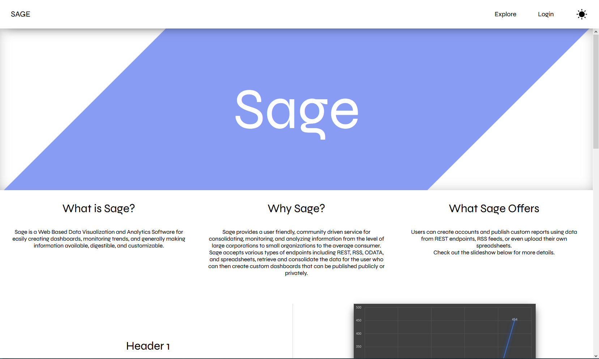

# Sage

## What is Sage?

Sage is a web based data visualization and real-time analytics software for easily creating dashboards, monitoring trends, and generally making information available, digestible, and customizable. 

## How does it work?

Users provide REST endpoints to Sage, which scrapes the data and keeps it up to date. Users can create dashboards with visualizations that best fit their data and publish them for viewing. Sage is built on a stack of React, Redux, Sass, Node.js, Express, Redis, and PostgreSQL, written primarily in TypeScript. Please see the [wiki](https://github.com/JamesAC42/Sage/wiki) for more information.

## Contributors

- [James Crovo](https://github.com/JamesAC42)
- [William Allen](https://github.com/williamjallen)
- [Issaic Jeon](https://github.com/issaicjeon)
- [Pavankumar Ramadass](https://github.com/pavanramadass)

## Work Accomplished

### Fall 2020

- Established web server with several API endpoints for handling user account actions, dashboard creation, data retrieval, and web socket communication
- Set up data server and several REST scrapers including ODATA and GraphQL
- Database and cache schemas for storing user information as well as dashboard data
- Created basic front end design and user interfaces including a homepage, login/ registration, dashboard creation and editor, profile page, and explore page, plus the necessary back end integration

## Contributing

Sage is still in its very early stages of life. Upcoming features that are either currently being worked on or have yet to be started include but are not limited to:

- More REST data types - would involve research and development of writing custom scrapers that can be used to fetch data from users' endpoints given protocol specific argument fields
- Including multiple endpoints per dashboard - As of now only one endpoint is associated with every dashboard. Eventually, users should be able to add several.
- Data filters - Extremely important - the data Sage fetches for the user is of arbitrary format, which is less than ideal for smoothly transitioning into a simple visualization or graphic. Sage must offer an intuitive but comprehensive programmatic interface for filtering out the important details and converting the data into something more readable for a graphics library.
- Adding more types of visualizations - the dashboard editor space is in need of more types of visualizations. This task would include research of the capabilities of libraries such as D3.js and how to implement them within our page.
- Publishing / Visibility levels - After creating a dashboard, users should have the option to publish at varying levels of visibility, e.g. private, protected, public etc.
- Adding more robust functionality to the explore page - include features such as sorting methods, filters, search, and tags.
- User favorites and bookmarks
- User options - Changing password, email, username, profile picture

If you would like to contribute and have any questions, please contact [James](mailto:crovoj@rpi.edu). Also, please visit the wiki for setup instructions.

## Screenshots

